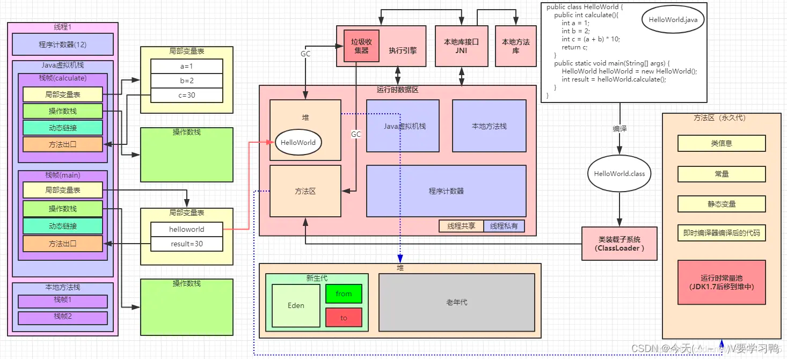
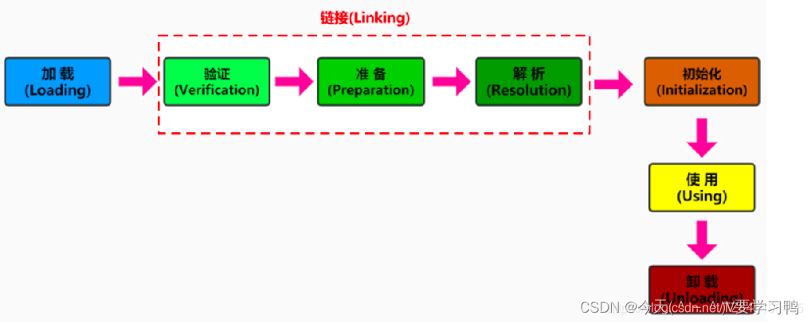
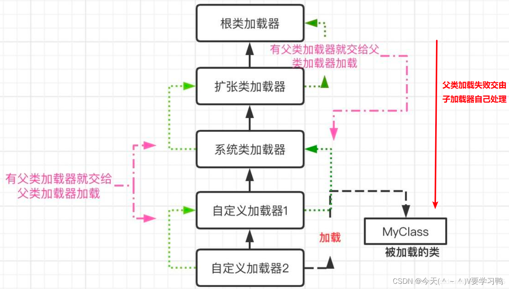

## 一.JVM & JAVA内存 & 类加载 ？  

## 1.1. 请说一下java为什么能跨平台，并且跨平台的原理  

java文件 -编译器编译-> 字节码 .class文件 -java虚拟机解释器-> 平台字节码  -与操作系统的统一接口-> 和 操作系统 交互  

## 1.2. JVM 内存结构 ？  

类加载器子系统：类加载器  
执行引擎子系统：JIT即时编译器，解释器和JIT编译器共存，GC  
运行时数据区：  VM内存模型 - 程序计数器、方法区、堆、java虚拟机栈、本地方法栈  
本地接口：     与操作系统交互的本地库接口    

我们写好的Java程序，通过java编译器把java文件编译成字节码.class文件，  
后通过 类加载器 将 class文件加载进 运行时数据区的方法区内，  
执行引擎 里的 JIT即时编译器器 将 class字节码文件 解释成平台机器码，交由cpu去执行  
cpu 通过 本地接口 跟操作系统交互。  

  

## 1.3. JVM 内存模型 ？  

堆 ： 新生代-伊甸园区eden & 幸存区survivor（s0 s1）、老年代  
java虚拟机栈：  
本地方法栈：  
方法区 ： 永久代/元空间  
程序计数器：  

## 1.4. 简述Java类加载机制(Java类加载过程) ？  

加载机制是指 类的加载、链接、初始化 的过程，其中，链接 包含：验证、准备、解析 过程。  

-> 加载: 将字节码文件中的.class文件，通过类加载器，加载进 方法区内，并创建Class对象  

-> 链接:(验证、准备、解析) -> 指将创建成的Class类合并至 Java 虚拟机中，使之能够执行的过程  

验证：文件格式，元数据、字节码 和 符号引用 验证等，确保.class字节流符合Java虚拟机规范  

准备：为静态字段信息（即使用 static 修饰过的变量）分配内存，并设置 初始值  

解析：将类中的符号引用变成直接引用  

-> 初始化: 执行类构造器 <clinit> 方法，执行静态代码块，为类变量初始化值  

  

## 1.5. 有哪些类型 类加载器 ？

4种，层级结构，依次为：  

**启动类加载器：**  
```
由C/C++编写，嵌套在JVM内部
加载核心类库(JAVA_HOME/jre/lib/rt.jar、resource.jar或sum.boot.class.path路径下的内容)，用于提供JVM自身需要的类(String类就是使用的这个类加载器)  
```
**扩展类加载器：**  
```
父类加载器为启动类加载器
加载扩展类库，从java.ext.dirs系统属性所指定的目录中加载类库，或从JDK的安装目录的jre/lib/ext子目录(扩展目录)下加载类库。如果用户创建的JAR放在此目录下，也会自动由扩展类加载器加载  
```
**应用程序类加载器：**  
```
父类加载器为扩展类加载器
加载环境变量classpath或系统属性java.class.path指定路径下的类库
调用System.getSystemClassLoader() | Thread.currentThread().getContextClassLoader()获取到的是系统类加载器
``` 
**自定义类加载器：**   
```
用户自定义类加载器,用来加载自定义内容.此加载器需要用户自己继承Classloader类
```
加载过程，依托 双亲委派机制 进行加载，保证加载过程中加载类的 唯一性 和 安全性  

## 1.6. 谈谈你对双亲委派机制的理解 ？  

①. 如果一个类加载收到了类加载请求，它并不会自己先去加载，而是把这个请求委托给父类加载器去执行  
②. 如果父类加载器还存在其父类加载器，则进一步向上委托，依次递归，请求最终将到达顶层的启动类加载器  
③. 当启动类加载器加载不了的时候，依次往下让子类加载器进行加载。这就是双亲委派模式   

  

优势：
```
1.避免类的重复加载,确保一个类的全局唯一性(当父ClassLoader已经加载了该类的时候,就没有必要子ClassLoader再加载一次)，比如:我们如果是引导类加载器加载了,就没必要再一次使用扩展类加载器进行加载
2.保护程序安全,防止核心API被随意篡改
```
劣势：
```
检查类是否加载的委托过程是单向的,这个方式虽然从结构上说比较清晰,使各个ClassLoader的职责非常明确,但是同时会带来一个问题,即顶层的ClassLoader无法访问底层的ClassLoader所加载的类)
```
